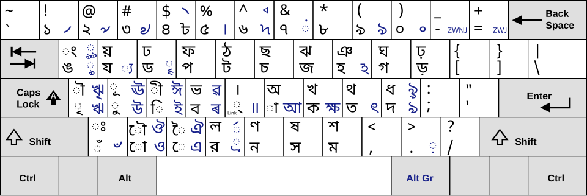

# jatiyo-keyboard-windows
Bangla jatiyo keyboard layout installer for Windows. Built to match the typing layout used by standard government systems and media outlets.
# Windows-এর জন্য জাতীয় (Jatiyo) কিবোর্ড লেআউট 🇧🇩
> A native, lightweight, and updated Jatiyo (জাতীয়) layout installer for Windows.

[English Version](#english) • [বাংলা সংস্করণ](#bangla) • [🚀 Download Latest Release](https://github.com/Jahid015/jatiyo-keyboard-windows/releases/latest)

---

## 🇬🇧 English Description

This repository provides a clean, native installation package for the official **Jatiyo (জাতীয়) Keyboard Layout** standard of Bangladesh. Built to exactly match the input standard used by the **Bangladesh Computer Council (BCC)** and major media outlets like **BBC Bangla**, this layout works natively inside the Windows operating system without requiring heavy third-party software running in the background.

### 🎯 Key Features
*   **100% Standard Compliant:** Matches the precise layout mapped by the Bangladesh Government/BCC.
*   **Native Windows Engine:** Integrated directly into the Windows Language Bar—switch seamlessly using `Win + Space` or `Alt + Shift`.
*   **Lightweight & Secure:** No startup delays, background services, or system bloat.

### 💡 Why I Built This (Motivation)
1. **Official Tool is Outdated:** The officially provided setup files from government sources are old, no keyboard shortcut support. 
2. **Seamless Linux-to-Windows Switching:** Linux distributions (like Ubuntu, Linux Mint, or Zorin OS) include the Jatiyo layout perfectly out of the box by default. If you use Linux but need to switch to Windows, this installer ensures your muscle memory stays exactly the same.

### 🚀 Installation Guide
1. Go to the **Releases** section on the right side/bottom of this page or **[Click here](https://github.com/Jahid015/jatiyo-keyboard-windows/releases/latest)** and download `jatiyo.zip` from latest release.
2. Extract the zip and double-click `setup.exe` to install.
3. Open Windows **Settings** (`Win + I`) > **Time & Language** > **Language & Region**.
4. Add **Bangla (Bangladesh)** if you haven't already. Click options, go to **Keyboards**, select **Add a keyboard**, and choose the **Jatiyo-custom** layout.

### ⚠️ Known Limitations & Special Controls
*   **The Vowel Sign Fallback:** In this native layout engine, pressing the Hasant followed by the Aa-kar (`্` + `া`) **will not** automatically merge to form the standalone vowel `আ`. The same rule applies to other standalone vowels (`আ` through `ঔ`).
*   **How to Type Standalone Vowels ($আ$ to $ঔ$):** To type independent vowels, use the **AltGr key** (which is the **Right Alt key** on your keyboard) combined with the standard key row mapping.

---

## 🇧🇩 বাংলা বিবরণী

উইন্ডোজ অপারেটিং সিস্টেমের জন্য এটি একটি আপডেটেড এবং সম্পূর্ণ নেটিভ **জাতীয় (Jatiyo) কিবোর্ড লেআউট** ইন্সটলার। **বাংলাদেশ কম্পিউটার কাউন্সিল (BCC)** এবং **বিবিসি বাংলা (BBC Bangla)**-র স্ট্যান্ডার্ড লেআউট অনুসরণ করে এটি তৈরি করা হয়েছে। এটি উইন্ডোজের নিজস্ব সিস্টেমে কাজ করে, তাই ব্যাকগ্রাউন্ডে কোনো ভারী সফটওয়্যার চালু রাখার প্রয়োজন নেই।

### 🎯 প্রধান বৈশিষ্ট্যসমূহ
*   **১০০% স্ট্যান্ডার্ড লেআউট:** বাংলাদেশ সরকার ও BCC নির্ধারিত সঠিক লেআউট ম্যাপ অনুসরণ করে তৈরি।
*   **উইন্ডোজ নেটিভ ইঞ্জিন:** সরাসরি উইন্ডোজ ল্যাঙ্গুয়েজ বারের সাথে যুক্ত হয়—সহজেই `Win + Space` বা `Alt + Shift` চেপে পরিবর্তন করা যায়।
*   **লাইটওয়েট এবং নিরাপদ:** পিসির গতি ধীর করে না এবং ব্যাকগ্রাউন্ডে কোনো সার্ভিস রান করে না।

### 💡 কেন এটি তৈরি করা হয়েছে (উদ্দেশ্য)
১. **অফিসিয়াল টুলটি অনেক পুরোনো:** সরকারি ওয়েবসাইটগুলোতে থাকা মূল লেআউট ফাইলগুলো বেশ পুরোনো এবং এটিতে শর্টকাট কি (Shortcuts) নেই, মনুয়লি লেআউট চেন্জ করতে হয়।  
২. **লিনাক্স থেকে উইন্ডোজে সহজ স্থানান্তর:** লিনাক্স ডিস্ট্রিবিউশনগুলোতে (যেমন- Ubuntu, Linux Mint, বা Zorin OS) ডিফল্টভাবেই জাতীয় লেআউটটি দেওয়া থাকে। যারা লিনাক্স ব্যবহার করার পাশাপাশি উইন্ডোজও ব্যবহার করেন, তাদের টাইপিং স্পিড এবং অভ্যাস ঠিক রাখতেই এটি তৈরি করা।

### 🚀 ইন্সটলেশন গাইড
১. এই পেজের ডানদিকের/একদম নিচের **Releases** সেকশন এ যান আথবা **[ক্লিক করুন](https://github.com/Jahid015/jatiyo-keyboard-windows/releases/latest)** এবং `jatiyo.zip` ফাইলটি ডাউনলোড করুন।  
২. জিপ ফাইলটি আনজিপ (Extract) করে `setup.exe` ফাইলটিতে ডাবল-ক্লিক করে ইন্সটল করুন।  
৩. উইন্ডোজের **Settings** (`Win + I`) > **Time & Language** > **Language & Region**-এ যান।  
৪. **Bangla (Bangladesh)** ল্যাঙ্গুয়েজটির Options-এ গিয়ে **Keyboards** সেকশন থেকে **Add a keyboard**-এ ক্লিক করে আপনার নতুন **Jatiyo-custom** লেআউটটি সিলেক্ট করে দিন।

### ⚠️ সীমাবদ্ধতা এবং বিশেষ টাইপিং নিয়ম
*   **স্বয়ংক্রিয় রূপান্তর কাজ করবে না:** এই নেটিভ ইঞ্জিনে হসন্তের পর আকার চাপলে (`্` + `া`) তা স্বয়ংক্রিয়ভাবে পূর্ণ স্বরবর্ণ `আ`-তে রূপান্তরিত হবে না। একইভাবে `আ` থেকে `ঔ` পর্যন্ত অন্যান্য কার চিহ্নগুলোও সরাসরি স্বরবর্ণে রূপান্তর হবে না।
*   **পূর্ণ স্বরবর্ণ ($আ$ - $ঔ$) টাইপ করার নিয়ম:** পূর্ণ স্বরবর্ণগুলো সরাসরি টাইপ করার জন্য আপনাকে কিবোর্ডের **AltGr কি (ডান পাশের Alt বাটনটি)** চেপে ধরে নির্দিষ্ট লেআউট বাটনটি প্রেস করতে হবে।

---

## ☕ Support & Donations (সহযোগিতা)

If this project saved you time and helped make your typing experience smooth, consider buying me a cup of tea! Your support helps maintain the project.

যদি এই প্রজেক্টটি আপনার দৈনন্দিন টাইপিংয়ের কাজকে সহজ করে থাকে, তবে আপনি চাইলে আমাকে এক কাপ চা খাওয়াতে পারেন! আপনার অবদান প্রজেক্টটি সচল রাখতে সাহায্য করবে।

| Payment Gateway | Account Type | How to Pay / Details |
| :--- | :--- | :--- |
| **bKash (বিকাশ)** | Personal (পার্সোনাল) | ![Maybe add in future] |
| **Nagad (নগদ)** | Personal (পার্সোনাল) | `9856 0010 0229 2104`   *(choose send money and give this 16 digit nagad virtual number on phone number section)*   *(সেন্ড মানি অপশনে গিয়ে ফোন নম্বরের অপশনে এই ১৬ ডিজিটের ভার্চুয়াল নাম্বার লিখুন)* |

---

---

## 📄 License / লাইসেন্স

This project is open-source software licensed under the [MIT License](LICENSE). 
এটি একটি ওপেন-সোর্স প্রজেক্ট যা এমআইটি (MIT) লাইসেন্সের অধীনে নিবন্ধিত।
